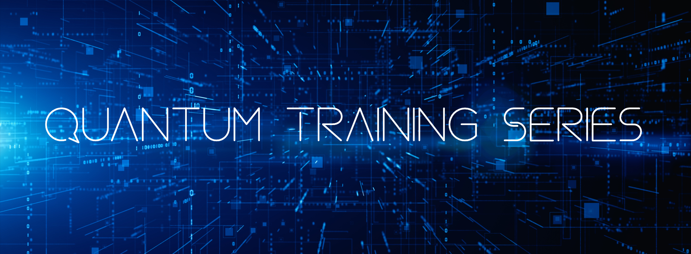

# Quantum Training Series

    

The OLCF is proud to offer the Quantum Training Series.
The Quantum Training Series is meant to highlight workflows, tools, software, and techniques used for quantum computing -- both within the realm of HPC and not.

This repository contains the tutorials relevant to the various Quantum Training Series events that have already happened or will happen in the future.

A list of the events (so far):

| Date     | Event                                 | Format | Material |
| :------- | :------------------------------------ | :----- | :------- |
| 10/01/25 | [PennyLane on Frontier 2025](https://www.olcf.ornl.gov/calendar/pennylane-on-frontier-2025/) | Tutorial | [Recording](https://vimeo.com/1123935172) |
| 01/13/26 | [Next-Gen Programming Stack on Helios](https://www.olcf.ornl.gov/calendar/quantinuums-next-generation-stack/) | Seminar | [Recording](https://vimeo.com/1157618726) |
| 01/22/26 | [IQM Pulse-level Programming](https://www.olcf.ornl.gov/calendar/exploring-the-pulse-level-programming-of-superconducting-qubits/) | Tutorial | [Recording](https://vimeo.com/1157612323) |
